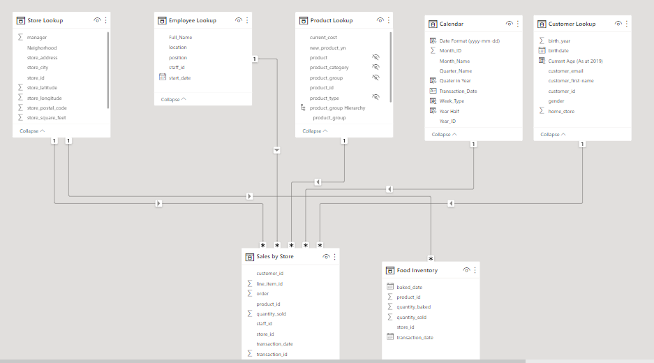
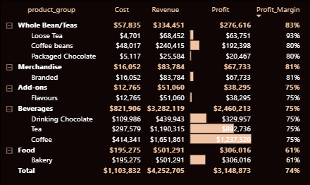
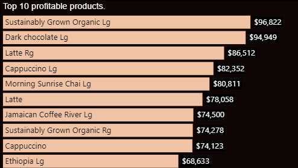

# Business Case
Being hired as the lead Business Intelligence Analyst for Maven Roasters, an imaginary small-batch coffee chain based in New York City.
All I’ve been given is a collection of raw csv files containing sales and inventory records, along with details about the company’s products, customers, stores and employees. The goal is to use Power BI and DAX to answer key questions about the Maven Roasters business, including sales trends, inventory, top products, and orders.

**_Disclaimer_**: _All datasets and reports do not represent any company, institution or country, but just a dummy dataset from Maven Analytics to demonstrate capabilities in Power BI._

The process flow in arriving at the insights includes:
- Importing the csv datasets into Power BI.
- Exploring the different variables, datatypes and relationships contained in the dataset.
- Not much was done in transforming the data as it came in already cleaned.
- Building relationship between the different tables and writing DAX to generate extra information about the data.
- Summarizing these information into visualizations and reports of findings with recommendations.
---
# Modelling

  
---
Sample DAX 1         | Sample DAX 2  
:-------------------:|:-----------------:
       |  

# Visualization
The report comprises of 3 pages:
- Homepage
- Customers Orders
- Sales and Profits
**You can interact with the report here** (In progress)

## Homepage

## Customer Orders

## Sales and Profits

# Analysis

