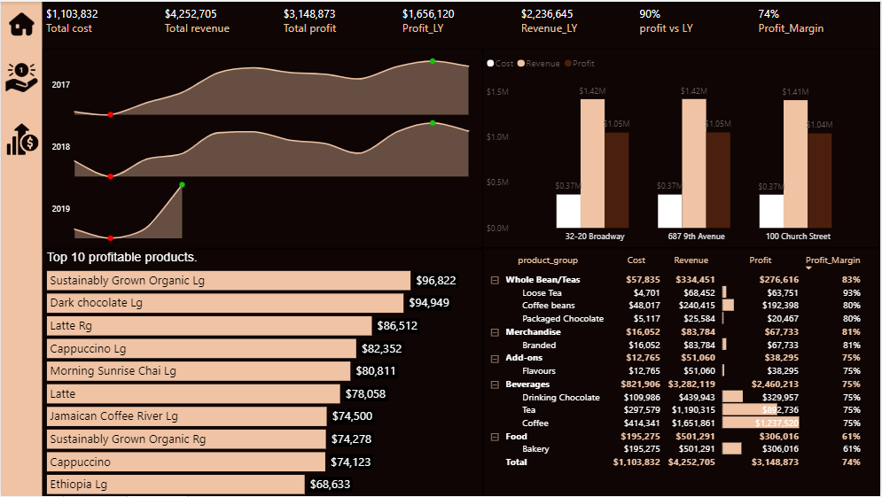
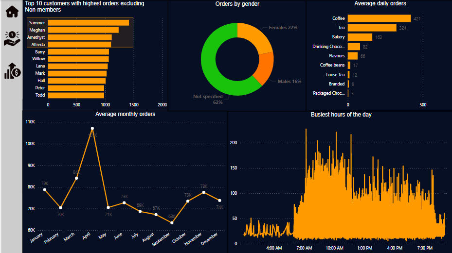
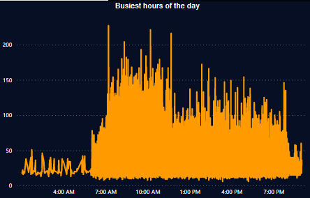
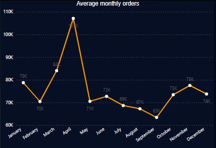
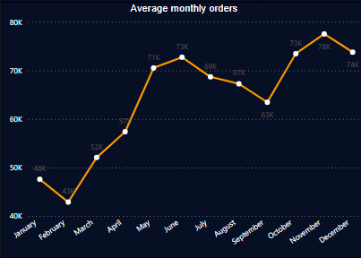
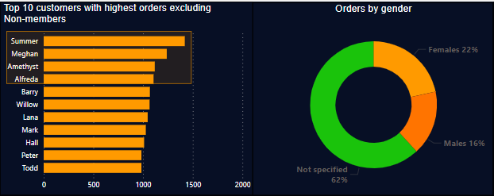

# Business Case
Being hired as the lead Business Intelligence Analyst for Maven Roasters, an imaginary small-batch coffee chain based in New York City.
All I’ve been given is a collection of raw csv files containing sales and inventory records, along with details about the company’s products, customers, stores and employees. The goal is to use Power BI and DAX to answer key questions about the Maven Roasters business, including sales trends, inventory, top products, and orders.

**_Disclaimer_**: _All datasets and reports do not represent any company, institution or country, but just a dummy dataset from Maven Analytics to demonstrate capabilities in Power BI._

The process flow in arriving at the insights includes:
- Importing the csv datasets into Power BI.
- Exploring the different variables, datatypes and relationships contained in the dataset.
- Not much was done in transforming the data as it came in already cleaned.
- Building relationship between the different tables and writing DAX to generate extra information about the data.
- Summarizing these information into visualizations and reports of findings with recommendations.
---

# Modelling

  
---
Sample DAX 1         | Sample DAX 2  
:-------------------:|:-----------------:
       |  
---
# Visualization
The report comprises of 3 pages:
- Homepage
- Sales and Profits
- Customers Orders

**You can interact with the report here** (In progress)

## Homepage

## Revenue and Profits

## Customer Orders

---

# Analysis and Recommendations
Maven Roasters comprises of 1 warehouse and 3 retail stores located in Newyork with 5,198 customers served by 55 employees ranging from Coffe wranglers, Roasters and Store managers with 88 blend of products across 9 different product categories.

### Revenue and Profit
Analysis shows high profitability in the current year at 90% vs last year and a profit margin ranging from 61% to 83% (74% on average) across a variety of product groups, with Whole bean/Tea being the highest followed by Merchandise. Top 3 most profitable products (Both in terms of profits generated and number of orders by customers) are Coffee, Tea and Drinking Chocolate with 75% profit margin under the Beverages product group.

Further analysis revealed consistent yearly dip in February (If this is due to weather conditions at the beginnning of the year, then stock levels can be controlled to avoid holding excess inventory) and peek in November with respect to revenue. Comparing revenues generated for February 2017 ($139k) and February 2018 ($149k), we noticed a 7% increase meanwhile about 67% increase between 2018 and 2019 February ($232k-current year) was recorded. If this trend continues, November could peek with over 20% of February 2019 sales revenue.

### Customer Orders
Orders starts coming in as early as 1am ranging from 18-48 orders per hour between 1am and 4am. However, the busiest hours of the day is usually between 7am-11:30am where orders can peek at 158 per hour. On average, about 1,070 orders are placed across Maven Roaters three retail outlets daily.

The charts below is a reflection of average monthly orders. The right chart shows orders including the current year 2019 (only recorded 3 months) while the left chart excluded 2019. With 2019 included, there is a spike in revenue between march and april which was due to the 67% increase in sales revenue between 2018 and 2019 februaries.

With 2019                          | Without 2019
:----------------------------------|:---------------------------:
    |    

Customers with highest orders are predominantly females with 22%, although a larger portion of customer orders at 67% did not specify gender. An increased sales and profits can be recorded if more female appealing products and adverts are made. Note that Top 4 customers are females.

